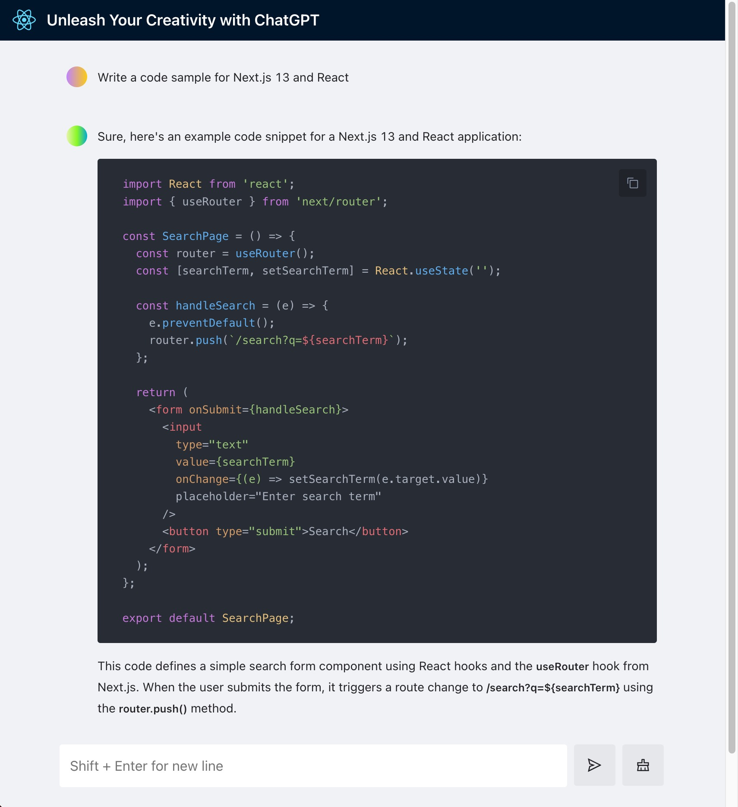

# VYSP.AI x ChatGPT Demo with Next.JS

This is a demo project using VYSP.AI Security platform to protect a ChatGPT demo application.

It uses the VYSP.AI JS client to pretect the ChatGPT application. [NPM](https://www.npmjs.com/package/vysp-js)

Thanks to [blrchen](https://github.com/blrchen/chatgpt-minimal) for the base application for this demo.

## Features

This demo is a lightweight chatbot built using Next.js and the OpenAI Streaming API for the GPT-3.5 model. It supports both OpenAI and Azure OpenAI accounts.

Components:

- VYSP.AI JS Client 
- Next.js v13
- OpenAI Streaming API (GPT-3.5 model, gpt-3.5-turbo)
- API Routes
- Chatbot UI with React and Ant Design

## Prerequisites

You need an OpenAI account with API Key access, and a [VYSP.AI](https://dashboard.vysp.ai/signup) account.

## VYSP.AI Setup

### Get started on the VYSP.AI Platform
Navigate to [VYSP.AI](https://dashboard.vysp.ai/signup)
Sign up for an account, and move on to the next step.

### Create a Gate
Once you're logged in, go to "Gates" in the sidebar or navigate to https://dashboard.vysp.ai/gates

Click "Add Gate" in the top right, and enter a name for your application, like "Chat Application"

### Add Rule
Go to the Flows page in the sidebar, and you'll see that two flows were created, one input flow and one output flow.

Go to the Input Flow and click "Add Rule". Enter a name, and select "Prompt Injection Detection". Click "Submit" and you'll see that the rule was created.

Add any other rules you want to use.

### Back to your IDE

Go back to your IDE, and create a ".env.local" file using the ".env.example" file in the same directory.

### Grab your credentials
The dropdown menu that has your username in it contains your Tenant API key, copy and add to your .env, assigned to the variable "NEXT_PUBLIC_VYSP_TENANT_API_KEY". Then, go to the gate you just created, and copy the gate's API key. Copy and assign the env variable "NEXT_PUBLIC_VYSP_GATE_API_KEY".

## Deployment

Refer to the [Environment Variables](#environment-variables) section for required environment variables.

## Development

### Running Locally

1. Install NodeJS 20.
2. Clone the repository.
3. Install dependencies with `npm install`.
4. Copy `.env.example` to `.env.local` and modify environment variables as needed.
5. Start the application using `npm run dev`.
6. Open `http://localhost:3000` in your browser.

## Environment Variables

Required environment variables:

For VYSP.AI Configuration - Refer to the [VYSP.AI Setup](#vyspai-setup) section:

| Name                      | Description                                    |
| ------------------------- | ---------------------------------------------- |
| NEXT_PUBLIC_VYSP_TENANT_API_KEY | Tenant API Key |
| NEXT_PUBLIC_VYSP_GATE_API_KEY      | Gate API Key                                            |

For OpenAI account:

| Name                | Description                                                                                             | Default Value            |
| ------------------- | ------------------------------------------------------------------------------------------------------- | ------------------------ |
| OPENAI_API_BASE_URL | Use if you intend to use a reverse proxy for `api.openai.com`.                                          | `https://api.openai.com` |
| OPENAI_API_KEY      | Secret key string obtained from the [OpenAI API website](https://platform.openai.com/account/api-keys). |

For Azure OpenAI account:

| Name                      | Description                                    |
| ------------------------- | ---------------------------------------------- |
| AZURE_OPENAI_API_BASE_URL | Endpoint (e.g., https://xxx.openai.azure.com). |
| AZURE_OPENAI_API_KEY      | Key                                            |
| AZURE_OPENAI_DEPLOYMENT   | Model deployment name                          |

## Contribution

We welcome PRs of all sizes.
